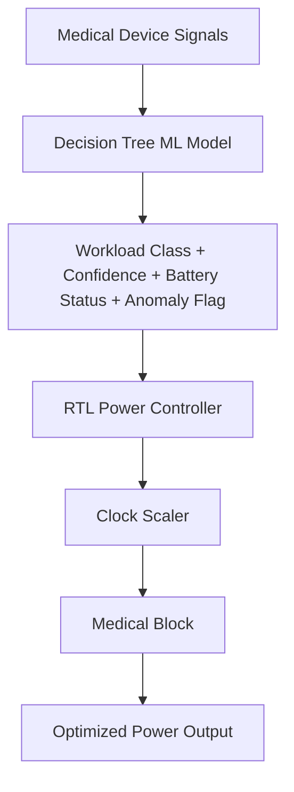
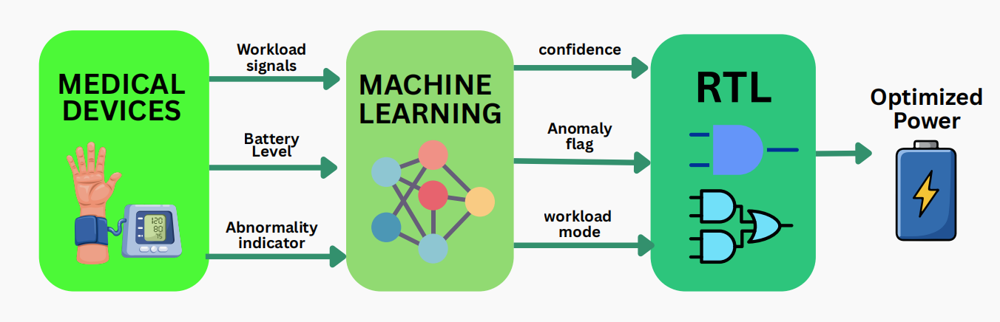
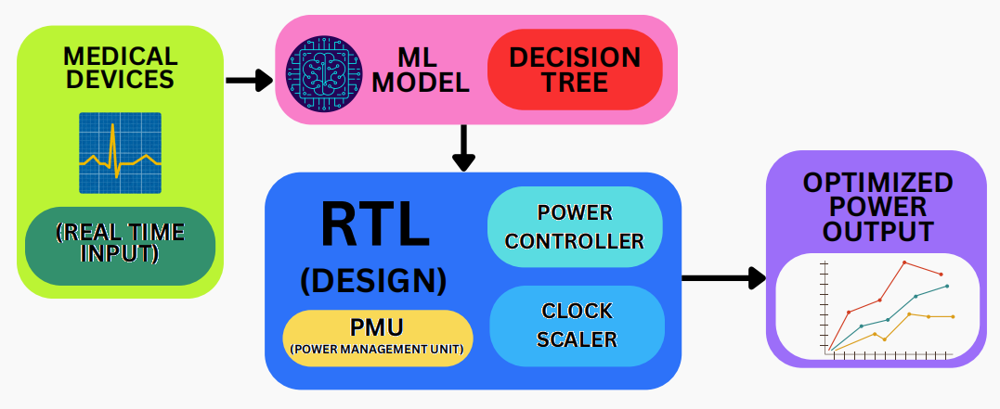
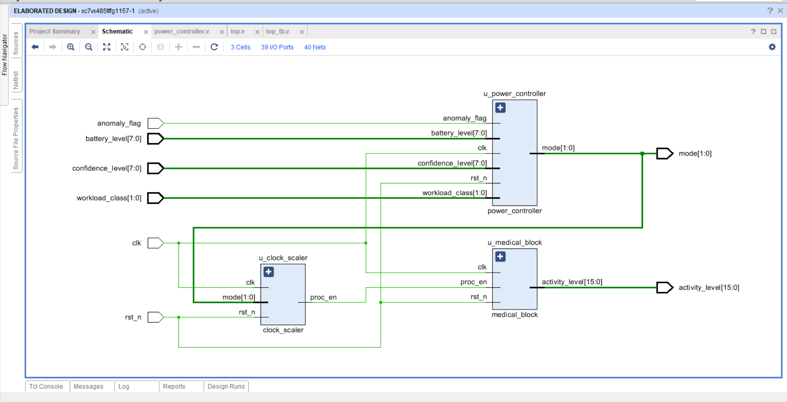
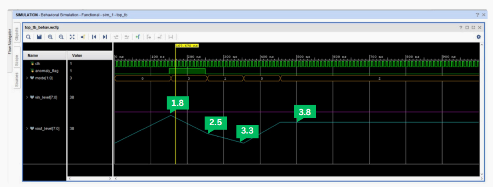
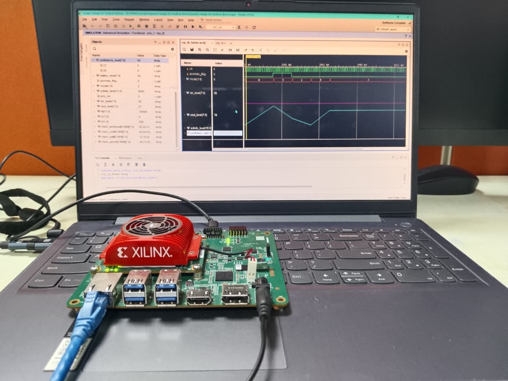

# 🩺 Zen-X: AI-Powered Power Management for FPGA-Enabled Medical Devices

---

## 📖 Introduction
Modern medical devices require **safe, reliable, and energy-efficient performance**.  
Zen‑X introduces an **ML-powered RTL power manager** that predicts workload using a Decision Tree model and dynamically adjusts voltage/frequency on FPGA hardware.  

This ensures:
- ⚡ Optimized energy usage during normal operation  
- 🛡 Emergency-aware overrides during anomalies  
- 🔋 Extended battery life for portable medical devices  

---

## 🎯 Problem Statement
Medical devices demand **intelligent power management** to balance:
- Performance  
- Safety  
- Battery efficiency  

Zen‑X solves this by integrating:
- **ML workload prediction**  
- **Adaptive RTL power controller**  
- **Clock scaling logic**  
- **Emergency override mechanisms**  

---

## ⚡ Proposed Solution
- 🧠 ML model predicts workload (low, medium, high, critical).  
- 🔌 RTL hardware adjusts voltage/frequency accordingly.  
- 🚨 Emergency conditions trigger instant high-power mode.  
- 🔋 Battery-aware logic prevents unsafe high-power states.  
- ✅ Smooth transitions between voltage islands ensure stability.  

---

## 🔄 System Flow

---

## 🏛 Architecture

- **Inputs:** Sensor data, battery level, anomaly flag  
- **ML Model:** Decision Tree for workload prediction  
- **Outputs:** Workload class, confidence level, anomaly detection  
- **RTL Modules:**
  - `power_controller.v` → selects operating mode & voltage island  
  - `clock_scaler.v` → adjusts frequency domains  
  - `medical_block.v` → simulates device activity  
  - `top.v` → integrates all modules  
  - `tb_top.v` → testbench with ML-generated inputs
  - 

 

---

## 📊 Performance Metrics
| ⚙️ Metric              | 📈 Value           |
|------------------------|-------------------|
| ⏱ Latency             | Sub-μs transitions|
| 🔋 Voltage Islands     | 1.8V, 2.5V, 3.3V, 3.8V |
| 🧠 ML Model            | Decision Tree     |
| 🛡 Emergency Mode      | Instant 3.8V boost|
| ⚡ Clock Domains       | LP, Normal, High, Emergency |
| 🖥 FPGA Board          | Xilinx Kria AI Vision |

---

## 📈 Simulation Results
- Mode transitions: `0 → 3 → 1 → 0 → 2`  
- Emergency flag triggers **3.8V spike** instantly  
- Smooth voltage scaling across modes (1.8V, 2.5V, 3.3V, 3.8V)  
- Clock remains stable; only `proc_en` pulses vary  
- Input and output voltages track correctly, validating RTL logic

 

---

## 🖥 Real-Time Implementation
- Deployed successfully on **Xilinx Kria AI Vision FPGA**  
- Verified voltage transitions in hardware (1.8V → 3.8V → 2.5V → 1.8V → 3.3V)  
- Emergency detection boosted instantly to max power mode  
- Hardware waveforms matched simulation results  
- Demonstrated readiness for integration into real medical devices
 

---

## Clock Skewing

---

## Voltage Scaling

---

## 🌟 Salient Features
- 🚨 **Emergency-Aware Power Boost** → safety-first overrides  
- 📊 **Confidence-Driven Decisions** → conservative fallback at low confidence  
- 🔋 **Battery-Aware Adjustment** → prevents unsafe high-power states  
- ⚡ **Adaptive Clock Domains** → balances speed & energy  
- 🔐 **Safety-Aware Control** → multiple fallback layers

  

---

## 🔋 Contrast with Existing Solutions
| Feature                  | Traditional Systems | Zen-X Smart Model |
|---------------------------|---------------------|------------------|
| Clock Scaling             | Fixed               | Adaptive & ML-driven |
| Power Usage               | Static              | Dynamic & optimized |
| Anomaly Handling          | Weak                | Instant emergency override |
| Workload Prediction       | None                | ML-based inference |

---

## ✅ Advantages
- Extended device lifespan  
- Energy-efficient operation  
- Reliable performance during spikes  
- Safety-first design for medical use  
- Scalable for diverse medical platforms  

---

## 🔮 Future Enhancements
- 🧩 Custom IP modularization  
- 📈 Continuous ML refinement with real data  
- 🔋 Advanced voltage isolation for efficiency  
- 🛡 Enhanced safety fallback layers  
- ⚙️ ASIC deployment for commercial medical devices  

---

## 📜 Conclusion
Zen‑X demonstrates the **fusion of ML intelligence with FPGA hardware** for medical devices.  
By predicting workload and adapting power modes in real time, it achieves **performance, energy efficiency, and safety** — the three pillars of modern healthcare technology.  
This scalable, reliable framework is ready for next-generation medical hardware platforms.
